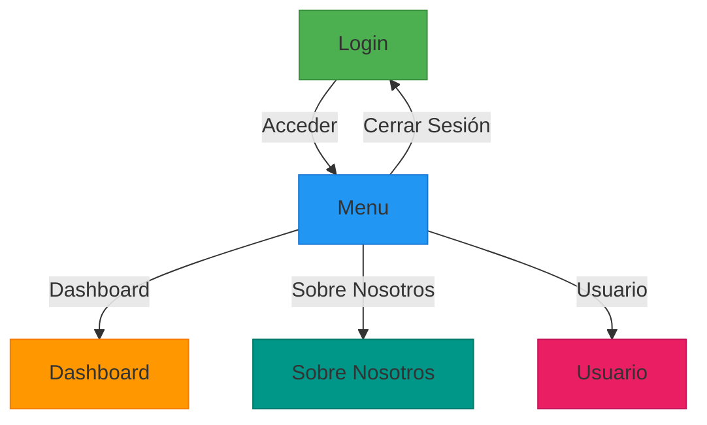

# SalesPredictor por Maximo Mora 

## Descripción:

SalesPredictor es un Proyecto de Mínima Necesidad (PMN) que consiste en un sistema de predicción de ventas desarrollado con React en el frontend y Flask en el backend, utilizando TensorFlow y Pandas para procesar datos históricos y generar predicciones. Su objetivo es ayudar a visualizar el comportamiento futuro de las ventas de un producto, facilitando la toma de decisiones mediante gráficas interactivas.

## 🛠️ Instalación

### Requisitos:
 - bun, 
 - python3

### Frontend: 

 - cd frontend

 - bun install

 - bun run dev

### Backend:

 - python -m venv venv (desde la raiz de proyecto)

 - pip install -r backend/requirements.txt

 - cd backend

 - python app.py

------------------------------------------------

